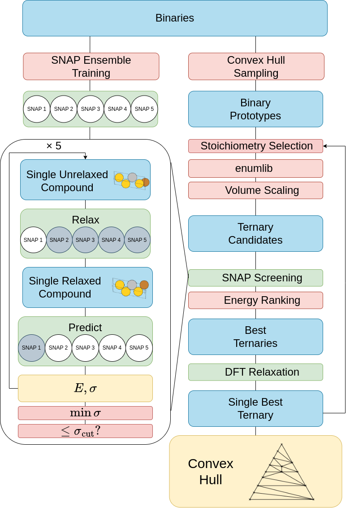

# Workflow_Ternary_ConvexHull

In this reporistory, data is given associated with the pre-print referenced below. They concern the two tenrary systems studied: CuAgAu and MoTaW.

The directory system for each contains:

- The AFLOWlib labels of the binaries selected during the convex hull sampling (AFLOW_IDs/). 
- The AFLOWlib labels of the binaries whose structures are used as parent prototypes for the ternaries (Parent_database/).
- The hyperparameters and parameters of the SNAP models used (SNAP/).
- The enthalpy of formation of the lowest energy compound identified at each stoichionetry probed (Enthalpy).

## Publication

Rossignol, H, Minotakis, M, Cobelli, M, Sanvito, S, "Machine-Learning-Assisted Construction of Ternary Convex Hull Diagrams." arXiv preprint arXiv:2308.15907 (2023).

## Workflow Flow Chart: 

